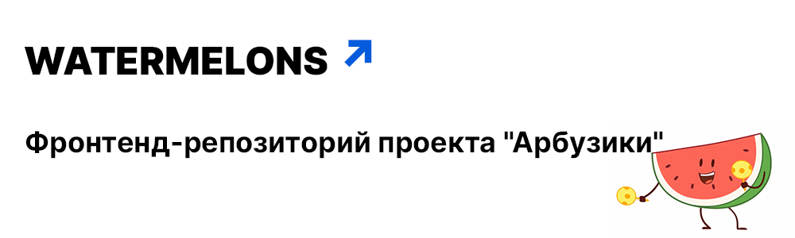

## Ссылки:

- [Production версию сайта](https://watermelons-rmr.netlify.app)
- [Develop версию сайта](https://develop--watermelons-rmr.netlify.app)
- [Макет проекта в Figma](https://www.figma.com/file/4VxqFExw7rSdNK6HXFLe64/Watermelons?node-id=443%3A134)
  > Макет не является руководством, а служит для понимания общего стиля приложения.

## Развёртывание проекта:

***Перед запуском проекта убедитесь, что у вас установлен `Node.js` версии `v18.5.0` или старше и `npm` не ниже `8.12.1`.***

Затем выполните следующие команды:

* `npm install` - для установки всех необходимых зависимостей
* `npm start` - для запуска проекта

## Технические особенности:

### Используемый стек технологий:

  
  
  
  
  
  
  
  
  
  
  
  

### Архитектура:

Структура проекта построена по методологии [Feature-Sliced Design v.2](https://feature-sliced.design/)

Примерная структура слоёв и сегментов (вхождения опциональны):

<pre>
app/                                # <b>Инициализирующая логика приложения</b>
    ├── providers/                  # Провайдеры приложения (Store, BrowserRouter...)
    ├── store/                      # Инициализация стора Redux
    └── styles/                     # Глобальные стили 

pages/                              # <b>Страницы приложения</b>
    ├── {pageName}/                 # Страница приложения
    |   ├── layout/                 # Композиция элементов страницы (список сущностей etc)
    |   |   └── ComponentName/      # Отдельный компонент страницы
    |   ├── lib/                    # Инфраструктурная логика (utils/helpers/types/hooks)
    |   └── PageName.tsx            # Страница, состоящая из layouts

widgets/                            # <b>Самостоятельные и полноценные блоки для страниц</b>
    ├── {widgetName}/
    |   ├── ui/                     # UI-логика
    |   ├── model/                  # Бизнес-логика (работа со стором)
    |   └── lib/                    # Инфраструктурная логика (utils/helpers/types/hooks)

features/                           # <b>Обрабатываемые пользовательские сценарии</b>
    ├── {featureGroup}/             # Группировка фич, в себе может содержать 
    |   |   |                         только слайс конкретной фичи. Нужен для обозначения
    |   |   |                         зоны ответственности
    |   |   ├── {featureName}       # Фича
    |   |   |    ├── ui/            # UI-логика
    |   |   |    ├── model/         # Бизнес-логика (работа со стором)
    |   |   |    └── lib/           # Инфраструктурная логика (utils/helpers/types)

entities/                           # <b>Бизнес-сущности, которыми оперирует предметная область</b>
    ├── {entityName}/
    |   ├── ui/                     # UI-логика
    |   ├── model/                  # Бизнес-логика (обычно работа со стейт-менеджером)
    |   └── lib/                    # Инфраструктурная логика (utils/helpers/types)

shared/                             # <b>Переиспользуемые модули, без привязки к бизнес-логике</b>
    ├── ui/                         # Общие UI-компоненты (кнопки, инпуты и т.д.)
    ├── api/                        # Запросы к бэку
    ├── assets/                     # Шрифты, картинки и т.д.
    ├── constants/                  # Общие константы
    ├── styles/                     # Стили для импорта (миксины, переменные)
    └── lib/                        # Инфраструктурная логика (utils/helpers/types)

При наличии единственного экземпляра в папках слайса - папка обычно опускается.       
</pre>

### CI/CD:

После каждого пуша в репозиторий: 

* Код проверятся на наличие ошибок линтинга (eslint, stylelint).
* Происходит сквозное тестирование проекта на работоспособность с помощью фреймворка cypress.
* Проект автоматически развертывается на сервере Netlify.

## Основные команды:

* `npm install` - установка зависимостей
* `npm start` - запуск проекта
* `npm run storybook` - запуск сторибука  
* `npm run lint` - проверка проекта на наличие ошибок линтинга (ESLint)
* `npm run stylelint` - проверка проекта на наличие ошибок линтинга (Stylelint)  
* `cy:open` - запуск интерфейса для ручного e2e тестирования (Cypress)
* `cy:run` - запуск e2e автотестов (Cypress)

## Технический долг:

> Архитектурой проекта был выбран Feature Sliced Design v. 2.0. - мы следовали его рекомендациям согласно официальной документации. Единственное и довольно значимое отклонение, это экспорт слайсов редакса из фич и любых других слоев, находящихся ниже app по иерархии - прям в конфиг редакс стора в app. Обычно так делать нельзя и app должен оставаться вне видимости остальных слоёв, но почитав их телеграм-канал и именно ответы core-команды этим было решено пренебречь.

### Требуют доработок:

* Мобильная адаптация и улучшение некоторых частей интерфейса.
* Полное отслеживание состояния заказа с продуманной логикой.

### Технические моменты:

* Декомпозирование и рефакторинг кода.
* Вынос интерфейсов, приходящих с бэкенда в единое место.
* В соответствии с методологией FSD, неплохо бы сделать Public API для всевозможных модулей.
* Спорный момент с корзиной - не понятно куда её правильно отнести к фиче или сущности, пока что лежит в фичах т.к. не существует самостоятельно без юзера.
* Сторибук есть только для ui-lib.
* Breadcrumbs можно сделать отдельным компонентом в widgets, т.к. используется почти на каждой странице для навигации.

