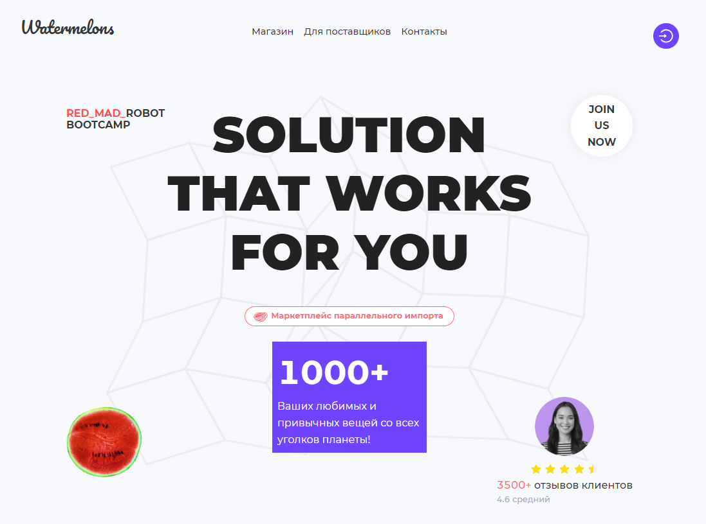

# Фронтенд проекта "Арбузики" - площадки для параллельного импорта

<strong>Для успешного запуска проекта вам потребуется `node.js` не ниже `v18.5.0` и `npm` не ниже `8.12.1` !</strong>

- [Деплой](https://watermelons-rmr.netlify.app)
- [Деплой для разработки](https://develop--watermelons-rmr.netlify.app)
- [Макет в Figma](https://www.figma.com/file/4VxqFExw7rSdNK6HXFLe64/Watermelons?node-id=443%3A134)
  > Макет не является руководством, а служит для понимания общего стиля приложения. Делайте на свой вкус! Для того чтобы получить доступ для редактирования - напишите мне в [телеграм](t.me/klimetzc) свою почту.

### Tech Stack:

- **`React`** + **`Typescript`**
- **`SCSS`**, **`Ant Design`**
- **`Redux toolkit`**

### Основа для архитектуры проекта - **Feature Sliced Design**

Структура и семантика слоёв взята с оф. гайда v. 2.0  
Структура слоёв и сегментов примерно такая (вхождения опциональны):

<pre>
app/                                # <b>Инициализирующая логика приложения</b>
    ├── providers/                  # Провайдеры приложения (Store, BrowserRouter...)
    ├── store/                      # Инициализация стора Redux
    └── styles/                     # Глобальные стили 

pages/                              # <b>Страницы приложения</b>
    ├── {pageName}/                # Страница приложения
    |   ├── layout/                 # Композиция элементов страницы (список сущностей etc)
    |   |   └── ComponentName/      # Отдельный компонент страницы
    |   ├── lib/                    # Инфраструктурная логика (utils/helpers/types/hooks)
    |   └── PageName.tsx            # Страница, состоящая из layouts

widgets/                            # <b>Самостоятельные и полноценные блоки для страниц</b>
    ├── {widgetName}/
    |   ├── ui/                     # UI-логика
    |   ├── model/                  # Бизнес-логика (работа со стором)
    |   └── lib/                    # Инфраструктурная логика (utils/helpers/types/hooks)

features/                           # <b>Обрабатываемые пользовательские сценарии</b>
    ├── {featureGroup}/             # Группировка фич, в себе может содержать 
    |   |   |                         только слайс конкретной фичи. Нужен для обозначения
    |   |   |                         зоны ответственности
    |   |   ├── {featureName}       # Фича
    |   |   |    ├── ui/            # UI-логика
    |   |   |    ├── model/         # Бизнес-логика (работа со стором)
    |   |   |    └── lib/           # Инфраструктурная логика (utils/helpers/types)

entities/                           # <b>Бизнес-сущности, которыми оперирует предметная область</b>
    ├── {entityName}/
    |   ├── ui/                     # UI-логика
    |   ├── model/                  # Бизнес-логика (обычно работа со стейт-менеджером)
    |   └── lib/                    # Инфраструктурная логика (utils/helpers/types)

shared/                             # <b>Переиспользуемые модули, без привязки к бизнес-логике</b>
    ├── ui/                         # Общие UI-компоненты (кнопки, инпуты и т.д.)
    ├── api/                        # Запросы к бэку
    ├── assets/                     # Шрифты, картинки и т.д.
    ├── constants/                  # Общие константы
    ├── styles/                     # Стили для импорта (миксины, переменные)
    └── lib/                        # Инфраструктурная логика (utils/helpers/types)

При наличии единственного экземпляра в папках слайса - папка обычно опускается.       
</pre>

## Основные команды:

`npm install` - установка проекта  
`npm start` - Приложение для разработки  
`npm run storybook` - Запуск сторибука  
`npm run lint` - lint  
`npm run stylelint` - stylelint
`cy:open`: Ручное e2e тестирование через отдельное API
`cy:run`: Запускает автоматические e2e тесты

### При деплое:

При каждом комите и пуше будут запускать проверки eslint и stylelint. Они пройдут, даже если есть варнинги. НО(!) при варнингах в еслинте сломается деплой, будьте внимательнее и при мерджах/пушах в develop и main проверяйте линты тщательно.

## Технический долг:

> Архитектурой проекта был выбран Feature Sliced Design v. 2.0. - мы следовали его рекомендациям согласно официальной документации. Единственное и довольно значимое отклонение, это экспорт слайсов редакса из фич и любых других слоев, находящихся ниже app по иерархии - прям в конфиг редакс стора в app. Обычно так делать нельзя и app должен оставаться вне видимости остальных слоёв, но почитав их телеграм-канал и именно ответы core-команды этим было решено пренебречь.

По реализации запланированного функционала осталось:

- Коллаборативные закупки
- Изначально планировалось добавить i18n
- Мобильная версия сайта неполноценна (отсутствует для продавца и можно улучшить UI)
- Полное отслеживание состояния заказа с продуманной логикой, сейчас там просто кнопки меняющие стейты

Из чисто технических моментов:

- Существует ветка refactor/RTK-Query, в ней обычные запросы переделаны под rtk-query, можно посмотреть и слить в develop, если захотите
- Вероятнее всего есть много мест где можно декомпозировать код. (Про учлучшения не говорю, т.к. проблема присутствует всегда и взгляды у всех разные)
- Надо будет вынести интерфейсы приходящих с бэка в единое место, сейчас они в разных местах
- По FSD неплохо бы сделать Public API для всевозможных модулей, также добавить абсолютные пути, вместо относительных при импортах
- Спорный момент с корзиной - не понятно куда её более правильно отнести к фиче или сущности, пока что лежит в фичах вместе т.к. не существует самостоятельно без юзера и создавалась раньше она только при первом пополнении корзины в UI (само создание на бэке).
- Слайсы страниц мне кажутся содержат много лишней логики, можно декомпозировать и подумать в какие слои распределить компоненты.
- Нет тестов
- Сторибук есть только для Ui-lib
- Можно сделать Breadcrumbs отдельным компонентом в widgets, т.к. используется почти на каждой странице для навигации и передавать в него пропсы для формирования массива ссылок
